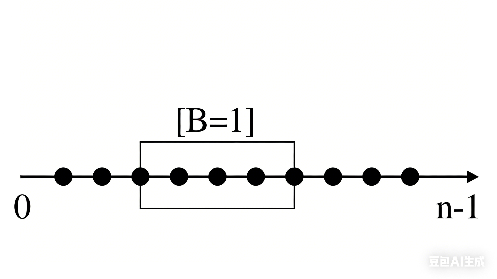
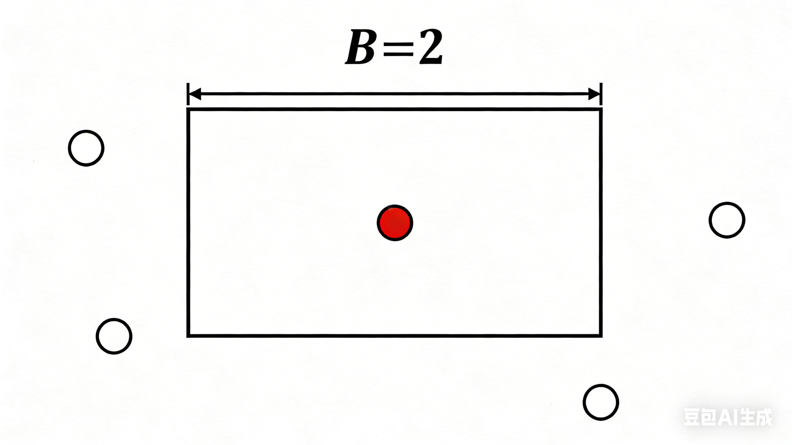
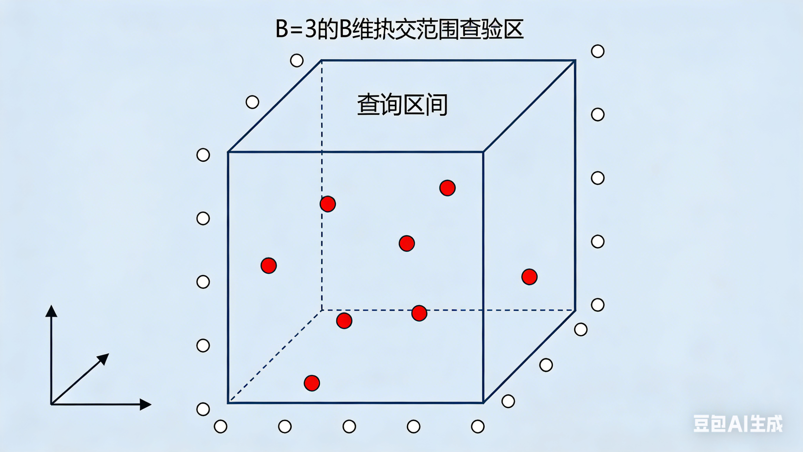

```metadata
title: B 维正交范围查询
date: 2026-04-01 12:00
category: 数据结构
difficulty: medium
```

## B 维正交范围查询

B 维正交范围查询是指在 B 维空间中，给定一个点集和一个查询矩形，要求统计落在该矩形内的点的数量或权值求和（求最值）。

下面以计算数量为例，权值求和或求最值的情况类似。

### 数学表示

其中 $P$ 是点集，其中每个点 $p_i$ 都是一个 B 维向量： $p_i = (p_{i1}, p_{i2}, \ldots, p_{iB})$，表示点在 B 维空间中的坐标。查询矩形 $j$ 由两个 B 维向量 $L_j$ 和 $R_j$ 定义，分别表示矩形的左下角和右上角的坐标。所需要要查询的点即为满足以下条件的点：

$$
\forall j = 1, 2, \ldots, B: \quad L_j \leq p_{ij} \leq R_j 
$$

### 算法实现

**B = 1 的情况**



1) 方法一：线段树 or 树状数组（在线）
   使用
    线段树或树状数组维护点的数量或权值，查询时根据 $L_j$ 和 $R_j$ 的范围进行区间查询。
2) 方法二：离线处理 + 二分
    将点离线处理，按照某一维度排序后，使用二分查找找到满足条件的点的范围。
3) 方法三：离线处理 + 扫描线
    将查询（拆分为两个事件）和点一起离线处理，按照某一维度排序后，使用扫描线算法统计满足条件的点的数量。

**扫描线算法详解**

1) 将所有点和查询事件按照某一维度（例如第一维）进行排序。
2) 使用一个数据结构（如线段树或数组甚至是一个变量）维护当前扫描线下的点的信息。
3) 当扫描线遇到一个点时，将其加入数据结构中。
4) 当扫描线遇到一个查询事件时，根据查询的范围 ，在数据结构中查询满足条件的点的数量或权值。

方法三核心代码：

``` c++
struct Event {
    int type; // 0 for point, 1 for query start, 2 for query end
    int x; // coordinate for sorting
    int id; // id of the point or query
};

vector<Event> events;

// 1. 将点和查询事件加入 events
for (const auto& point : points) {
    events.push_back({0, point[0], point_id});
}
for (const auto& query : queries) {
    events.push_back({1, query.L[0], query_id}); // query start
    events.push_back({2, query.R[0], query_id}); // query end
}

// 2. 按照 x 坐标排序 events
sort(events.begin(), events.end(), [](const Event& a, const Event& b) {
    return a.x < b.x || (a.x == b.x && a.type < b.type);
});
// 3. 扫描 events
for (const auto& event : events) {
    if (event.type == 0) {
        // 处理点事件，加入数据结构
    } else if (event.type == 1) {
        // 处理查询开始事件，查询数据结构
    } else {
        // 处理查询结束事件，更新结果
    }
}
```

**B = 2 的情况**



1) 方法一：树套树（在线）
   使用一个树套树的数据结构，外层树维护第一维度，内层树维护第二维度。
2) 方法二：离线处理 + 扫描线 + 树状数组
   将查询事件和点一起离线处理，按照第一维度排序后，使用扫描线算法统计满足条件的点的数量或权值。

**树套树详解**

1) 外层树维护第一维度的区间，内层树维护第二维度的区间。
2) 当插入一个点时，首先在外层树中包含其的所有区间对应的内层树中插入该点的第二维度坐标。
3) 当查询一个矩形时，首先在外层树中找到所有包含查询第一维度范围的区间，然后在对应的内层树中查询满足第二维度范围的点的数量或权值。

通常会选择外层线段树，内层平衡树或动态开点线段树实现

**树套树复杂度分析**

- 插入点的复杂度：$O(\log N \cdot \log M)$，其中 $N$ 是外层树的节点数，$M$ 是内层树的节点数。
- 查询矩形的复杂度：$O(\log N \cdot \log M)$，同样是因为需要在外层树中找到相关区间并在内层树中查询。

**扫描线算法降维思路**

将二维问题降维为一维问题，具体思路可以理解为是把空间上的一个维度看作时间维度，按照这个维度对事件进行排序，然后模拟时间的流逝来处理事件：我们在扫描线算法中，第一维度的坐标就相当于时间轴上的时间点，而第二维度的坐标则是我们需要维护的数据结构中的值。通过这种方式，我们可以将二维问题转化为一维问题来处理。

也就是扫描线算法可以将维护B-1维问题的在线算法通过离线处理用于解决B维问题。

扫描线降维模板核心代码：

``` c++
struct SubEvent {
    int type; // type of the sub-event (e.g., point insertion, query start, query end)
    // other attributes for the sub-event
    void insert() {
        // code to insert the sub-event into the data structure
    }
    void query() {
        // code to query the data structure for the sub-event
    }
};

struct Event {
    int x; // coordinate for sorting
    SubEvent subEvent; // the sub-event associated with this event
    int id; // id of the point or query
};

vector<Event> events;

// 1. 将点和查询事件加入 events
for (const auto& point : points) {
    events.push_back({point[0], SubEvent{/* initialize sub-event for point */}, point_id});
}
for (const auto& query : queries) {
    events.push_back({query.L[0], SubEvent{/* initialize sub-event for query start */}, query_id}); // query start
    events.push_back({query.R[0], SubEvent{/* initialize sub-event for query end */}, query_id}); // query end
}
// 2. 按照 x 坐标排序 events
sort(events.begin(), events.end(), [](const Event& a, const Event& b) {
    return a.x < b.x || (a.x == b.x && a.subEvent.type < b.subEvent.type);
});
// 3. 扫描 events
for (const auto& event : events) {
    if (event.subEvent.type == /* point event type */) {
        event.subEvent.insert(); // 处理点事件，加入数据结构
    } else if (event.subEvent.type == /* query start event type */) {
        event.subEvent.query(); // 处理查询开始事件，查询数据结构
    } else {
        // 处理查询结束事件，更新结果
    }
}
```

**B=3的情况**



1) 方法一：树套树套树（在线）
   使用一个树套树套树的数据结构，外层树维护第一维度，中间树维护第二维度，内层树维护第三维度。 (过于复杂)
2) 方法二：离线处理 + 扫描线 + 树套树
   将查询事件和点一起离线处理，按照第一维度排序后，使用扫描线算法统计满足条件的点的数量或权值。
    在扫描线过程中，使用树套树的数据结构来维护第二维度和第三维度的信息。
3) 方法三：离线处理 + 时间分治 + 扫描线
   将查询事件和点一起离线处理，按照第一维度排序后，使用时间分治的方法来处理查询事件和点。
    在每个时间段内，使用扫描线算法来统计满足条件的点的数量或权值。

**何为分治**

分治是一种算法设计范式，它将一个复杂的问题分解成更小、更简单的子问题，递归地解决这些子问题，然后将它们的结果合并以得到原始问题的解。

经典的分治方法通常包含以下三个步骤：
1) 分解：将原始问题分解成若干个规模较小的子问题，这些子问题通常是原问题的子集。
2) 解决：递归地解决这些子问题。当子问题的规模足够小到可以直接解决时，直接返回结果。
3) 合并：将子问题的结果合并成原始问题的解。

如果分治算法的分解和合并步骤都能在多项式时间内完成，并且子问题的规模至少是原问题的一半，那么该算法的时间复杂度通常为 $O(n \log n)$。

但有时分治算法也可以同时解决多个查询问题，我们解决此类问题会分别计算每个操作对每个查询的贡献，最后将每个查询的贡献进行合并得到最终结果。具体步骤如下：

1) 将所有的操作和查询按照某一维度进行排序。需要保证在排序后，所有的操作都在其产生贡献的查询之前。
2) 考虑将排序后的操作和查询分成两半，递归地处理左半部分和右半部分。
3) 最后考虑左半部分的操作对右半部分的查询的贡献，使用扫描线算法来统计满足条件的点的数量或权值。

**时间分治 + 扫描线算法详解**

我们发现对于时间分治算法需要找到一个可以排序的维度满足：在该维度上，所有的操作都发生在其产生贡献的查询之前。

而对于扫描线算法需要找到一个可以排序的维度满足：在该维度上，所有的操作都发生在其产生贡献的查询之前。

也就是说我们需要找到**两个**维度满足：在该维度上，所有的操作都发生在其产生贡献的查询之前。

而对于B维正交范围查询，每个维度排序后都满足这个要求，我们可以选择第一维度作为时间分治的维度，第二维度作为扫描线算法的维度。

具体步骤如下：
1) 将所有的操作和查询按照第一维度进行排序。
2) 考虑将排序后的操作和查询分成两半，递归地处理左半部分和右半部分。
3) 最后考虑左半部分的操作对右半部分的查询的贡献，使用扫描线算法来统计满足条件的点的数量或权值。
4) 在扫描线过程中，先按照第二维度对操作和查询进行排序，然后使用扫描线算法来统计满足条件的点的数量或权值。
5) 最后将每个查询的贡献进行合并得到最终结果。

代码：

``` c++
struct Event {
    int type; // type of the event (e.g., point insertion, query)
    // other attributes for the event
    int x, y, z; // coordinates for sorting
};

vector<Event> events;

void solve(int l, int r) {
    if (l >= r) return;
    int mid = (l + r) / 2;

    int mid_x = events[mid].x; // 以第一维度的坐标作为分界点

    solve(l, mid);
    solve(mid + 1, r);
    
    // 处理左半部分的操作对右半部分的查询的贡献
    sort(events.begin() + l, events.begin() + mid + 1, [](const Event& a, const Event& b) {
        return a.y < b.y; // 按照第二维度排序
    });

    for (int i = l; i <= r; ++i) {
        if (events[i].x < mid_x && events[i].type == /* point event type */) {
            // 处理点事件，加入数据结构
        }
        if (events[i].x >= mid_x && events[i].type == /* query event type */) {
            // 处理查询事件，查询数据结构
        }
    }
}

int main(){
    // 输入点和查询
    // 将点和查询加入 events
    sort(events.begin(), events.end(), [](const Event& a, const Event& b) {
        return a.x < b.x; // 按照第一维度排序
    });
    solve(0, events.size() - 1);
}
```

**注意事项**
最好不要按照维度的数值进行二分，可能导致分治死循环（如一定如此做，需要特判多个点x坐标相同的情况）

**B > 3 的情况**

对于B > 3 的情况，树套树套树等方法过于复杂，时间分治 + 扫描线算法的思路仍然适用，可以多次使用时间分治。

**时间分治降维原理**

时间分治算法的核心思想是将操作之间贡献的计算拆分为两个部分：一个是子问题内部操作对查询的贡献，一个是子问题之间操作对查询的贡献。本质是快速计算所有操作对所有查询的贡献。可以将一个离线的解决B维问题的算法看作扩展到B+1维的离线算法.

## 例题分析

### [动态逆序对](https://www.luogu.com.cn/problem/P3157)

**题目描述**：给定一个长度为 $n$ 的排列，初始有 $n$ 个操作，每个操作删除一个数。每次删除后，求当前序列的逆序对数量。

**CDQ 分治解法**：

这个问题可以转化为三维偏序问题。对于点 $(i, a_i, t_i)$，其中 $i$ 是位置，$a_i$ 是权值，$t_i$ 是删除时间（未删除则为 $m+1$，已删除则为删除时刻）。

两个点 $(i, a_i, t_i)$ 和 $(j, a_j, t_j)$ 构成逆序对的条件是：
- $i < j$ 且 $a_i > a_j$
- $t_i > t_j$（$i$ 在 $j$ 之后删除）

即满足：$i < j$，$a_i > a_j$，$t_i > t_j$

这是一个三维偏序问题，可以使用 CDQ 分治解决。

**CDQ 分治步骤**：

1. **第一维排序**：按 $x$ 坐标（位置 $i$）排序
2. **分治**：将区间 $[l, r]$ 分为 $[l, mid]$ 和 $[mid+1, r]$
3. **递归处理**：分别处理左右两半
4. **归并处理跨区间贡献**：
   - 将左半和右半按第二维（权值 $a$）排序
   - 用树状数组维护第三维（时间 $t$）的信息
   - 计算左半的点对右半的查询的贡献

**核心代码**：

```cpp
struct Node {
    int x, y, z;  // 位置、权值、时间
    int type;     // 0:点, 1:查询
    int id;       // 编号
    int val;      // 权值（+1或-1）
} e[N<<1];

void cdq(int l, int r) {
    if (l == r) return;
    int mid = (l + r) >> 1;
    
    cdq(l, mid);
    cdq(mid+1, r);
    
    // 按第二维归并排序
    sort(e+l, e+mid+1, cmp_y);
    sort(e+mid+1, e+r+1, cmp_y);
    
    int j = l;
    for (int i = mid+1; i <= r; ++i) {
        while (j <= mid && e[j].y <= e[i].y) {
            if (e[j].type == 0) add(e[j].z, e[j].val);
            ++j;
        }
        if (e[i].type == 1) {
            ans[e[i].id] += e[i].val * (query(max_z) - query(e[i].z));
        }
    }
    // 清空树状数组
    for (int i = l; i < j; ++i) {
        if (e[i].type == 0) add(e[i].z, -e[i].val);
    }
}
```

**时间复杂度**：$O(n \log^2 n)$

**空间复杂度**：$O(n)$

---

### [[SDOI2009] HH 的项链](https://www.luogu.com.cn/problem/P1972)

**题目描述**：给定一个序列，多次询问区间 $[l, r]$ 中有多少种不同的数。

**问题转化**：

设序列中 $a_i$ 上一次出现的位置为 $pre_i$，如果 $a_i$ 没有出现过，则 $pre_i = 0$。

根据题意，如果一种数在区间中出现多次，只会产生一次贡献。不妨认为每种数产生贡献的位置是区间中第一次出现的位置。

**关键性质**：区间 $[l, r]$ 中不同数的个数 = 满足 $pre_i \le l-1$ 的 $i \in [l, r]$ 的个数。

**证明（反证法）**：
- 若 $a_i$ 在区间 $[l, r]$ 中第一次出现，则 $pre_i < l$（或 $pre_i = 0$），满足 $pre_i \le l-1$
- 若 $a_i$ 在区间 $[l, r]$ 中不是第一次出现，则存在 $j \in [l, r]$ 且 $j < i$ 使得 $a_j = a_i$，此时 $pre_i \ge l$，不满足条件
- 因此满足 $pre_i \le l-1$ 的位置恰好对应每种数的第一次出现位置

**二维数点模型**：

将每个位置 $i$ 看作二维平面上的点 $(i, pre_i)$，问题转化为：

> 查询矩形 $[l, r] \times [0, l-1]$ 中的点数

即左下角为 $(l, 0)$，右上角为 $(r, l-1)$ 的矩形。

**差分技巧**：

注意到查询矩形 $[l, r] \times [0, l-1]$ 可以差分为：
- $Q(r, l-1)$：矩形 $[0, r] \times [0, l-1]$ 中的点数
- 减去 $Q(l-1, l-1)$：矩形 $[0, l-1] \times [0, l-1]$ 中的点数

这样就将任意矩形查询转化为以原点为左下角的矩形查询，便于使用扫描线。

**扫描线算法**：

按第一维（横坐标 $i$）枚举，使用树状数组维护第二维（纵坐标 $pre_i$）的前缀和。

1. **加点操作**：当扫描到位置 $i$ 时，在树状数组的位置 $pre_i$ 加 1
2. **查询操作**：对于查询 $(r, l-1)$，查询树状数组前缀 $[0, l-1]$ 的和

由于使用了差分，每个询问需要两次查询：
- 查询 $Q(r, l-1)$
- 查询 $Q(l-1, l-1)$
- 答案 = $Q(r, l-1) - Q(l-1, l-1)$

**实现细节**：

```cpp
struct Query {
    int r, bound, id;
    int sign;  // +1 或 -1，用于差分
};

vector<Query> queries;
vector<int> ans(m);

// 按 r 排序所有查询
sort(queries.begin(), queries.end(), [](const Query& a, const Query& b) {
    return a.r < b.r;
});

int ptr = 0;
for (int i = 1; i <= n; ++i) {
    // 加入点 (i, pre_i)
    add(pre_i, 1);
    
    // 处理所有 r = i 的查询
    while (ptr < queries.size() && queries[ptr].r == i) {
        ans[queries[ptr].id] += queries[ptr].sign * query(queries[ptr].bound);
        ++ptr;
    }
}
```

**复杂度分析**：
- 每次加点操作：$O(\log n)$
- 每次查询操作：$O(\log n)$
- 总操作数：$n$ 次加点和 $2m$ 次查询
- **总时间复杂度**：$O((n + m) \log n)$
- **空间复杂度**：$O(n + m)$

**总结**：

HH 的项链是二维数点问题的经典应用，通过：
1. 利用 $pre_i$ 将问题转化为二维数点
2. 使用差分技巧将任意矩形查询转化为以原点为左下角的矩形查询
3. 使用扫描线 + 树状数组实现 $O(\log n)$ 的单次操作

这是一个典型的 **B=2 二维正交范围查询** 问题，展示了扫描线降维思想的威力。

### [[传智杯 #4 初赛] 小卡与落叶](https://www.luogu.com.cn/problem/P8844)

**题目描述**：询问 dfs 序在区间 $[l, r]$ 且深度在区间 $[L, +\infty)$（即深度 $\ge L$）的结点数量。

**问题转化**：

这是一个**二维数点**问题，但查询的形状比较特殊：
- 第一维（dfs 序）：区间 $[l, r]$
- 第二维（深度）：后缀 $[L, +\infty)$

将每个结点 $u$ 看作二维平面上的点 $(dep_u, dfn_u)$，其中：
- $dep_u$ 是结点 $u$ 的深度
- $dfn_u$ 是结点 $u$ 的 dfs 序编号

那么查询就是：统计满足 $dep \ge L$ 且 $dfn \in [l, r]$ 的点数。

**关键观察**：

虽然查询是"后缀"形式（$dep \ge L$），但我们可以**改变扫描方向**：
- 以**深度**为第一维（扫描线方向）
- 以**dfs 序**为第二维（树状数组维护）

**离线处理策略**：

1. **点和查询排序**：
   - 将所有点按深度 $dep$ 从小到大排序
   - 将所有查询按深度阈值 $L$ 从小到大排序

2. **扫描线过程**：
   - 按深度从小到大枚举
   - 遇到一个点 $(dep, dfn)$，在树状数组的 $dfn$ 位置加 1
   - 遇到一个查询 $(L, l, r)$，此时树状数组中已加入所有深度 $< L$ 的点
   - 查询树状数组的区间 $[l, r]$ 和，得到深度 $< L$ 且在 $[l, r]$ 的点数
   - 用总点数减去该值，即得深度 $\ge L$ 且在 $[l, r]$ 的点数

3. **优化**：也可以将查询挂载到深度 $L$ 处，在深度达到 $L$ 时直接查询当前树状数组的区间和，此时树状数组中包含所有深度 $< L$ 的点。

**核心代码**：

```cpp
struct Point {
    int dep, dfn;
};

struct Query {
    int L, l, r, id;
};

vector<Point> points;
vector<Query> queries;
vector<int> ans(q);

// 按深度排序
sort(points.begin(), points.end(), [](const Point& a, const Point& b) {
    return a.dep < b.dep;
});

sort(queries.begin(), queries.end(), [](const Query& a, const Query& b) {
    return a.L < b.L;
});

int p = 0;
for (int i = 0; i < q; ++i) {
    // 加入所有深度 < L 的点
    while (p < n && points[p].dep < queries[i].L) {
        add(points[p].dfn, 1);
        ++p;
    }
    // 查询深度 < L 且在 [l, r] 的点数
    int cnt_less = query(queries[i].r) - query(queries[i].l - 1);
    // 总点数 = 子树大小（已知）
    int subtree_size = ...; // 通过 dfs 序性质：r - l + 1
    ans[queries[i].id] = subtree_size - cnt_less;
}
```

**简化版本**（利用 dfs 序性质）：

由于 dfs 序的连续性，区间 $[l, r]$ 内的结点总数就是 $r - l + 1$。因此：

```cpp
while (p < n && points[p].dep < L) {
    add(points[p].dfn, 1);
    ++p;
}
int cnt_less = query(r) - query(l - 1);
ans[id] = (r - l + 1) - cnt_less;
```

**复杂度分析**：
- 排序：$O(n \log n + q \log q)$
- 树状数组操作：$O((n + q) \log n)$
- **总时间复杂度**：$O((n + q) \log n)$
- **空间复杂度**：$O(n + q)$

**总结**：

小卡与落叶展示了二维数点问题的另一种变形：
1. 将树上的问题（dfs 序 + 深度）转化为二维数点
2. 通过**改变扫描方向**（以深度为第一维）处理后缀查询
3. 利用**离线扫描线 + 树状数组**实现高效查询
4. 利用 dfs 序的连续性简化计算

这也是 **B=2 二维正交范围查询** 的典型应用，体现了"选择合适的第一维"的重要性。


### 习题


[[CSP-S2025] 谐音转换](https://www.luogu.com.cn/problem/P14363)

[[蓝桥杯 2022 省 A] 选数异或](https://www.luogu.com.cn/problem/P8773)

[[Ynoi2016] 镜中的昆虫](https://www.luogu.com.cn/problem/P4690)